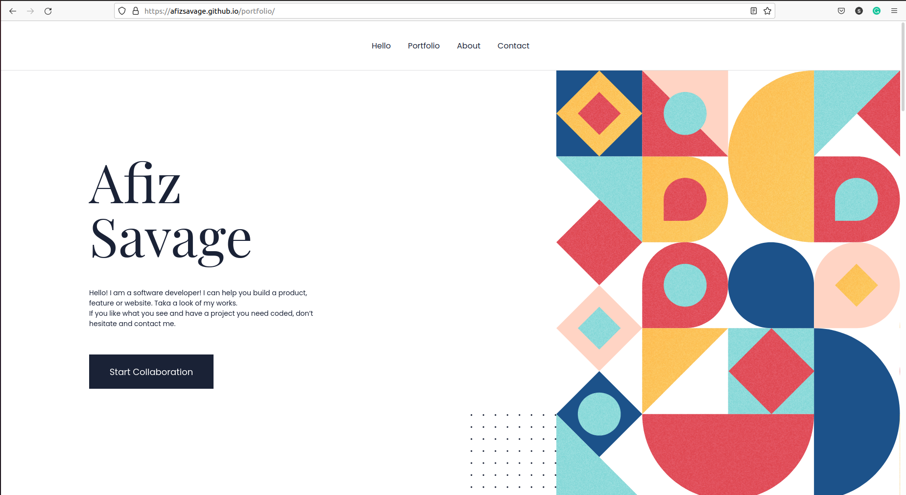

# Portfolio

> This is my personal portfolio website.

The website has sections for the collection of my most recent projects, contact information, and a link to download my CV.

## Built With

- HTML, CSS

## Live Demo

- [Demo](https://afizsavage.github.io/portfolio/)

## Getting Started

To get a local copy up and running follow these simple example steps.

### Prerequisites

- Node v12 updards

- Lighthouse

- Webhint

- Stylelint

### Setup

1.  Open a terminal, navigate to the directory that you would like to clone the repository into using commands like:

    - `cd /pathname` to change your working directory.

2.  Next, clone the remote repository and create a local copy on your machine using this command:

    - `git clone https://github.com/afizsavage/portfolio.git`

3.  Now you can see the contents of the remote repository on your machine by moving into the newly cloned directory:

    - `cd portfolio`
    - `ls -la`

### Run

Open the index.html file in the a browser

## Author

👤 **Afiz Savage**

- GitHub: [@afizsavage](https://github.com/afizsavage)
- Twitter: [@fizzo_geek](https://twitter.com/fizzo_geek)
- LinkedIn: [@afiz-savage](https://www.linkedin.com/in/afiz-savage-3b91a21ba/)

## Show your support

Give a ⭐️ if you like this project!
